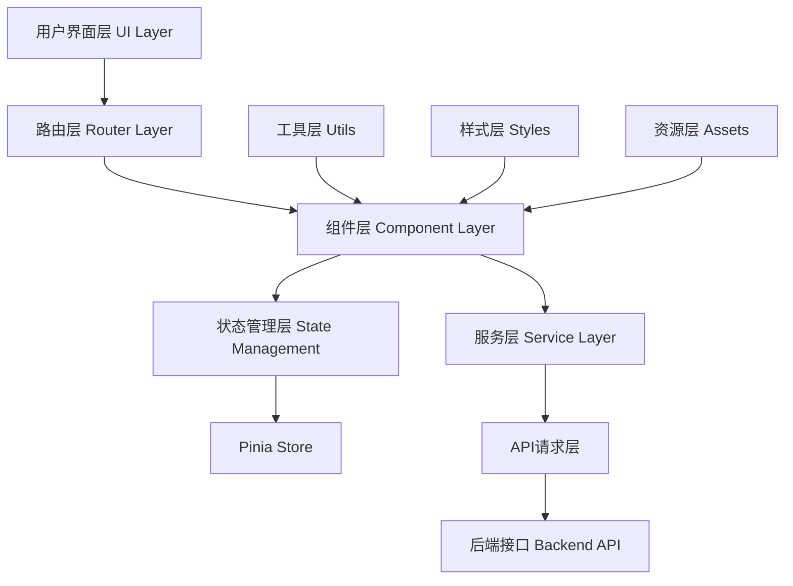

# Mall Management System | 商城管理系统

一个基于 Vue 3 的现代化商城管理系统，提供完整的电商后台管理解决方案

---

## 🖼️ 界面展示

### 管理后台

#### 登录界面
<!-- 在此处插入登录页面截图 -->


#### 仪表板总览
<!-- 在此处插入仪表板截图 -->


#### 商品管理
<!-- 在此处插入商品管理页面截图 -->


#### 订单管理
<!-- 在此处插入订单管理页面截图 -->


#### 用户管理
<!-- 在此处插入用户管理页面截图 -->


#### 实时监控
<!-- 在此处插入实时监控页面截图 -->


#### 数据分析
<!-- 在此处插入数据分析页面截图 -->


### 用户前台

#### 首页展示
<!-- 在此处插入首页截图 -->


#### 商品详情
<!-- 在此处插入商品详情页截图 -->


#### 购物车
<!-- 在此处插入购物车页面截图 -->


#### 个人中心
<!-- 在此处插入个人中心截图 -->


#### 社区互动
<!-- 在此处插入社区页面截图 -->


### 移动端适配

#### 移动端首页
<!-- 在此处插入移动端首页截图 -->


#### 移动端商品列表
<!-- 在此处插入移动端商品列表截图 -->


---

## 🚀 项目概述

Mall Management System 是一个功能完整的电商平台管理系统，采用前后端分离架构，为电商企业提供商品管理、订单处理、用户管理、数据分析等全方位的后台管理功能。系统设计注重用户体验和操作效率，支持实时数据监控和智能化管理。

### 核心价值

- **🎯 统一管理**：集成商品、订单、用户、评论等核心业务模块
- **📊 数据驱动**：实时监控系统状态，提供可视化数据分析
- **🤖 智能助手**：集成AI功能，提升运营效率
- **📱 响应式设计**：支持多设备访问，适配各种屏幕尺寸
- **🔐 安全可靠**：完善的权限管理和数据安全保障

---

## ✨ 功能特性

### 🛍️ 商品管理
- **商品分类管理**：支持多级分类，树形结构展示
- **商品列表管理**：批量操作、状态管理、库存监控
- **图片审核系统**：商品图片质量控制和合规性检查
- **价格管理**：灵活的定价策略和促销管理

### 📦 订单管理
- **订单处理流程**：从下单到发货的完整流程管理
- **支付记录追踪**：多种支付方式的交易记录
- **订单状态监控**：实时跟踪订单状态变化
- **退款处理**：便捷的退款审核和处理机制

### 👥 用户管理
- **用户信息维护**：完整的用户档案管理
- **地址管理**：用户收货地址的增删改查
- **权限控制**：基于角色的访问控制系统
- **用户行为分析**：购买习惯和偏好分析

### 💬 客服系统
- **实时聊天**：WebSocket技术支持的即时通讯
- **消息管理**：统一的消息中心和通知系统
- **聊天记录**：完整的对话历史记录
- **智能客服**：AI助手辅助客服工作

### 🌐 社区管理
- **内容审核**：帖子和评论的审核机制
- **社区互动**：用户互动和内容管理
- **话题管理**：热门话题和标签系统

### 📊 数据分析
- **实时监控**：系统状态和业务指标实时展示
- **销售统计**：多维度的销售数据分析
- **用户分析**：用户行为和偏好洞察
- **财务报表**：收入、成本和利润分析

---

## 🏗️ 技术架构

### 前端技术栈

```
Vue 3.5.18          # 渐进式JavaScript框架
├── Vite 4.0.0      # 下一代前端构建工具
├── Pinia 3.0.3     # Vue 3状态管理
├── Vue Router 4.5.1 # 官方路由管理器
├── Ant Design Vue 4.2.6 # 企业级UI组件库
├── ECharts 5.6.0   # 数据可视化图表库
├── Axios 1.11.0    # HTTP请求库
├── Day.js 1.11.13  # 轻量级日期处理库
├── Bootstrap 5.3.7  # CSS框架
├── Animate.css 4.1.1 # CSS动画库
└── Font Awesome 4.7.0 # 图标库
```

### 架构模式



### 模块化设计

- **🎨 视图层 (Views)**：页面级组件，包含管理后台和用户前台
- **🧩 组件层 (Components)**：可复用的UI组件
- **🗄️ 状态管理 (Stores)**：Pinia管理的全局状态
- **🌐 API层 (API)**：统一的接口请求封装
- **🛠️ 工具层 (Utils)**：通用工具函数和配置
- **🎭 服务层 (Services)**：业务逻辑服务

---

## 🚀 快速开始

### 环境要求

- **Node.js**: >= 14.x
- **npm**: >= 6.x 或 **yarn**: >= 1.x
- **现代浏览器**: 支持ES2015+

### 安装步骤

```bash
# 1. 克隆项目
git clone <repository-url>
cd mall_management

# 2. 安装依赖
npm install
# 或使用 yarn
yarn install

# 3. 启动开发服务器
npm run dev
# 或使用 yarn
yarn dev

# 4. 构建生产版本
npm run build
# 或使用 yarn
yarn build

# 5. 预览构建结果
npm run preview
# 或使用 yarn
yarn preview
```

### 开发环境配置

```bash
# 开发服务器将运行在
http://localhost:5173

# API接口配置
# 请在 src/utils/request.js 中配置后端API地址
```

---

## 📁 项目结构

```
mall_management/
├── public/                 # 静态资源
├── src/                   # 源代码目录
│   ├── api/              # API接口封装
│   │   ├── auth.js       # 认证相关
│   │   ├── product.js    # 商品管理
│   │   ├── order.js      # 订单管理
│   │   ├── user.js       # 用户管理
│   │   └── ...          # 其他业务模块
│   ├── assets/          # 资源文件
│   │   └── css/         # 样式文件
│   ├── components/      # 公共组件
│   ├── composables/     # 组合式函数
│   ├── router/          # 路由配置
│   ├── services/        # 服务层
│   ├── stores/          # Pinia状态管理
│   │   ├── userStore.js # 用户状态
│   │   ├── cartStore.js # 购物车状态
│   │   └── ...         # 其他状态模块
│   ├── utils/          # 工具函数
│   │   ├── request.js  # HTTP请求封装
│   │   └── websocket.js # WebSocket封装
│   ├── views/          # 页面组件
│   │   ├── Admin/      # 管理后台
│   │   │   ├── components/ # 后台组件
│   │   │   └── AdminView.vue
│   │   ├── Home/       # 用户前台
│   │   │   ├── components/ # 前台组件
│   │   │   └── HomeView.vue
│   │   ├── LoginView.vue # 登录页面
│   │   └── RegisterView.vue # 注册页面
│   ├── App.vue         # 根组件
│   └── main.js         # 入口文件
├── index.html          # HTML模板
├── package.json        # 项目配置
├── vite.config.js      # Vite配置
└── README.md          # 项目文档
```

## 🔧 核心功能详解

### 实时通信系统

基于WebSocket技术实现的实时通信功能：

```javascript
// WebSocket连接管理
class WebSocketManager {
  connect() {
    // 建立连接
  }
  
  onMessage(callback) {
    // 消息处理
  }
  
  send(data) {
    // 发送消息
  }
}
```

**功能特色：**
- 🔄 自动重连机制
- 💬 实时聊天支持
- 📢 系统通知推送
- 📊 订单状态实时更新

### 状态管理系统

使用Pinia构建的响应式状态管理：

```javascript
// 用户状态管理
export const useUserStore = defineStore('user', {
  state: () => ({
    userInfo: null,
    permissions: []
  }),
  
  actions: {
    async login(credentials) {
      // 登录逻辑
    }
  }
})
```

**管理模块：**
- 👤 用户状态 (userStore)
- 🛒 购物车状态 (cartStore)
- 💬 聊天状态 (chatStore)
- 📢 消息状态 (messageStore)
- 🔔 通知状态 (notificationStore)

### AI智能助手

集成人工智能功能，提升用户体验：

**AI功能模块：**
- 🤖 智能客服对话
- 📊 数据分析建议
- 🎯 个性化推荐
- 📝 内容生成辅助

---

## 💡 技术亮点

### 🎨 响应式设计
- **多端适配**：完美支持桌面端、平板、手机
- **弹性布局**：CSS Grid + Flexbox混合布局
- **主题系统**：支持多主题切换，暗黑模式

### ⚡ 性能优化
- **代码分割**：路由级别的懒加载
- **组件缓存**：Keep-alive组件缓存
- **资源优化**：图片懒加载、CDN加速
- **构建优化**：Vite快速构建和热更新

### 🔐 安全保障
- **权限控制**：基于RBAC的权限管理
- **数据验证**：前后端双重数据验证
- **XSS防护**：输入内容过滤和转义
- **CSRF保护**：请求令牌验证

### 🧪 开发体验
- **TypeScript支持**：类型安全的开发体验
- **ESLint规范**：代码质量和风格统一
- **热更新**：开发时实时预览变更
- **调试工具**：Vue DevTools支持

---

## 📋 开发规范

### 代码规范

```javascript
// 组件命名：PascalCase
export default {
  name: 'ProductCard'
}

// 变量命名：camelCase
const productList = ref([])

// 常量命名：UPPER_SNAKE_CASE
const API_BASE_URL = 'https://api.example.com'
```

### 文件结构规范

```
ComponentName/
├── index.vue          # 主组件文件
├── components/        # 子组件
├── composables/      # 组合式函数
├── styles/           # 组件样式
└── __tests__/        # 测试文件
```

### Git提交规范

```bash
feat: 新功能
fix: 修复bug
docs: 文档更新
style: 样式修改
refactor: 代码重构
test: 测试相关
chore: 构建过程或辅助工具的变动
```

---

## 🚢 部署说明

### 生产环境构建

```bash
# 构建生产版本
npm run build

# 构建产物位于 dist/ 目录
```

### 部署方式

#### 1. 静态服务器部署

```bash
# 将 dist/ 目录内容部署到静态服务器
# 如：Nginx、Apache、IIS等
```

#### 2. CDN部署

```bash
# 推荐使用以下平台：
# - Vercel
# - Netlify
# - GitHub Pages
# - 阿里云OSS
# - 腾讯云COS
```

#### 3. Docker部署

```dockerfile
FROM nginx:alpine
COPY dist/ /usr/share/nginx/html/
EXPOSE 80
CMD ["nginx", "-g", "daemon off;"]
```

### 环境变量配置

```bash
# .env.production
VITE_API_BASE_URL=https://api.yourapi.com
VITE_WS_URL=wss://ws.yourapi.com
```

---

## 🤝 贡献指南

### 开发流程

1. **Fork项目** → 2. **创建分支** → 3. **提交代码** → 4. **发起PR**

```bash
# 1. Fork并克隆项目
git clone <your-fork-url>

# 2. 创建功能分支
git checkout -b feature/your-feature-name

# 3. 提交变更
git commit -m "feat: add your feature"

# 4. 推送分支
git push origin feature/your-feature-name

# 5. 创建Pull Request
```

### 代码审查标准

- ✅ 代码符合项目规范
- ✅ 功能测试通过
- ✅ 无明显性能问题
- ✅ 文档更新完整

---

## 📞 联系方式

- **项目地址**：[GitHub Repository](your-repo-url)
- **文档地址**：[项目文档](your-docs-url)
- **问题反馈**：[Issues](your-issues-url)
- **邮箱联系**：your-email@example.com

---

## 📄 许可证

本项目采用 [MIT License](LICENSE) 许可证。

**如果这个项目对您有帮助，请给我们一个 ⭐️**

Made with ❤️ by [LUO]
